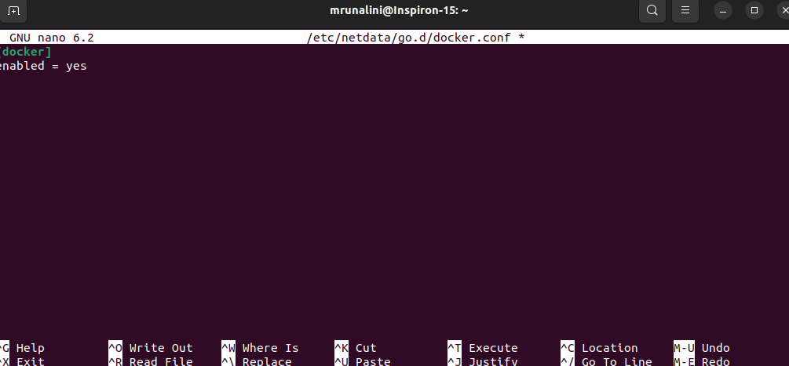
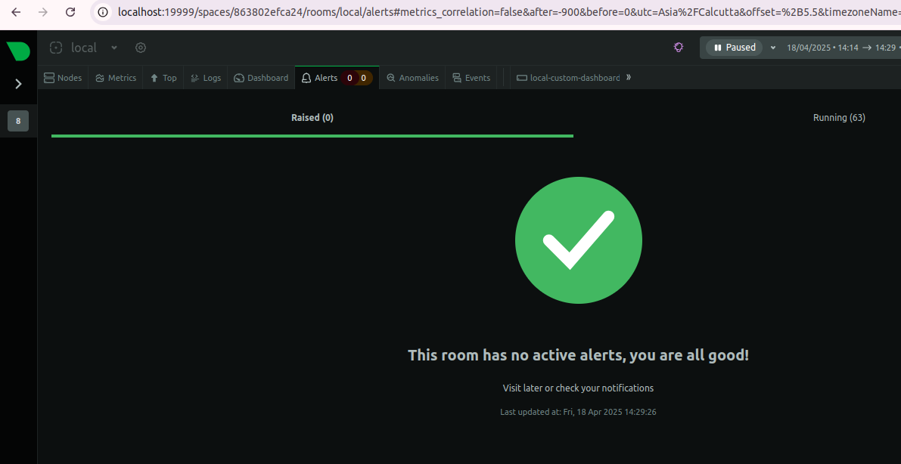
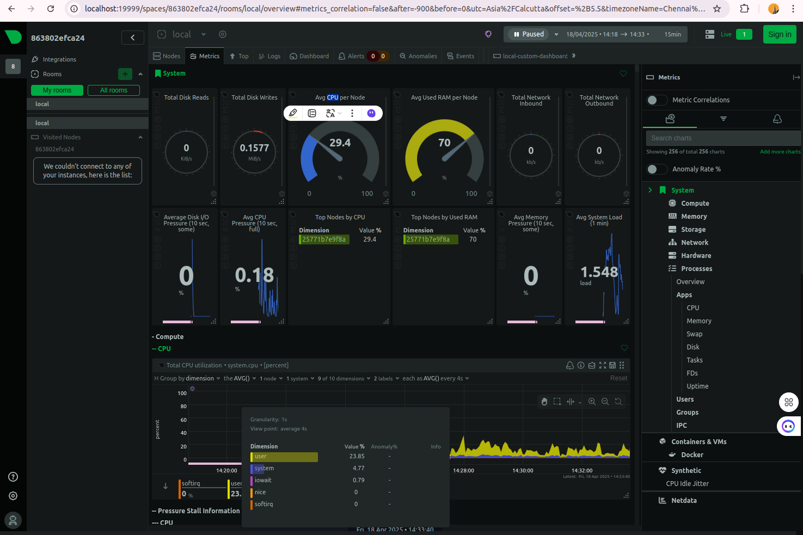

# Task 7: Monitor System Resources Using Netdata

## Objective
Install Netdata and visualize system and app performance metrics in real-time.

## Steps Followed
- Ran Netdata using Docker:
  ```bash
  docker run -d --name=netdata -p 19999:19999 netdata/netdata

Accessed the Netdata dashboard at http://localhost:19999

Monitored CPU, Memory, Disk, and Docker container stats

Explored alerts, charts, and logs located at /var/log/netdata


# Netdata Monitoring Task

This project demonstrates setting up Netdata to monitor system resources like CPU, memory, and disk usage.

## Screenshots 📸

### 1. Netdata Dashboard Home


### 2. CPU & Memory Usage


### 3. Docker Containers Monitoring


---

🚀 **Powered by Mruna** 🌟


